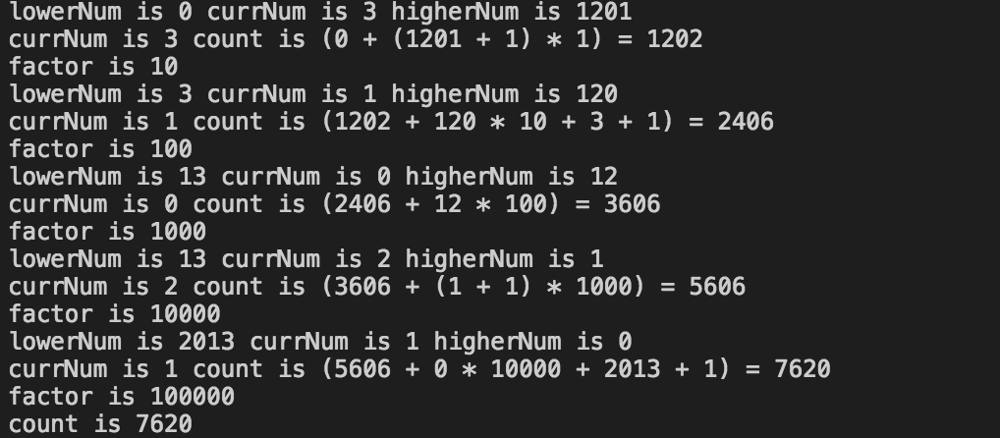

# 判断一个数字是不是2的幂

很简单 x&x-1 == 0  

衍生问题1

计算从0到N中包含数字1的个数：

```python
def count_one(n):
    count=0
    factor = 1
    lowerNum = 0
    currNum = 0
    higherNum = 0
    while ((n/factor) > 0):
        lowerNum = n - (n/factor)*factor
        currNum = (n/factor)%10
        higherNum = n/(factor*10)
        print "lowerNum is %d currNum is %d higherNum is %d " % (lowerNum, currNum, higherNum)
        precount = count
        if currNum == 0:
            count = count + higherNum * factor
            print "currNum is 0 count is (%d + %d * %d) = %d" % (precount, higherNum, factor, count)
        elif currNum == 1:
            count = count + higherNum * factor + lowerNum + 1
            print "currNum is 1 count is (%d + %d * %d + %d + 1) = %d " % (precount, higherNum, factor, lowerNum, count)
        else:
            count = count + (higherNum + 1) * factor
            print "currNum is %d count is (%d + (%d + 1) * %d) = %d " % (currNum, precount, higherNum, factor, count)
        factor = factor * 10
        print "factor is %d " % factor
    
    print "count is %d" % count 
            
            
        
       
        

if __name__ == '__main__':
    count_one(12013)


```

运行结果：




衍生问题2:

求二进制中2的个数

```python
def count_binary_one(n):
    c=0
    while n != 0:
        print bin(n)
        n = n & (n -1)
        c = c+1
    print c    
```

其实每次挪走了右边的1