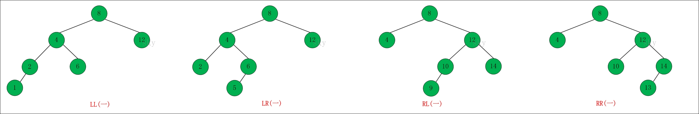
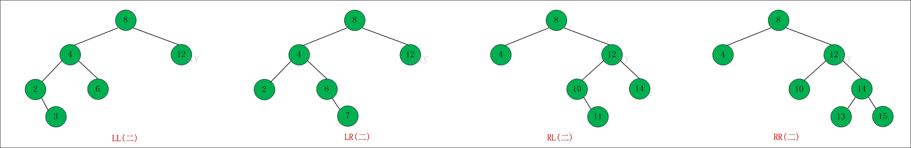

# 平衡二叉树

### 平衡二叉树

AVL树，任何节点的两个子树的高度最大差别为1，所以，也称为高度平衡二叉树。查找，插入和删除在平均最坏的情况下都是O(log n)

定义节点：

```java
public class AVLTree<T extends Comparable<T>> {
  private AVLTreeNode<T> mRoot;
  class AVLTreeNode<T extends Comparable<T>> {
    T key;
    int height;
    AVLTreeNode<T> left;
    AVLTreeNode<T> right;
    
    public AVLTreeNode(T key, AVLTreeNode<T> left, AVLTreeNode<T> right) {
      this.key = key;
      this.left = left;
      this.right = right;
      this.height = 0;
    }
  }
}
```

AVL树失衡 一定是 **LL， LR，RR，RL。**





**LL左单旋转**

```java
private AVLTreeNode<T> llRotation(AVLTreeNode<T> k2) {
  AVLTreeNode<T> k1;
  
  k1 = k2.left;
  k2.left = k1.right;
  k1.right = k2;
  
  k2.height = max(height(k2.left), height(k2.right)) + 1;
  k1.height = max(height(k1.left), k2.height) + 1;
  return k1;
}
```


**RR旋转**

```java
private AVLTreeNode<T> rrRotation(AVLTreeNode<T> k1) {
  AVLTreeNode<T> k2;
  
  k2 = k1.right;
  k1.right = k2.left;
  k2.left = k1;
  
  k1.height = max(height(k1.left), height(k1.right)) + 1;
  k2.height = max(height(k2.right), k1.height) + 1;
  return k2;
}
```


**LR旋转**

```java
private AVLTreeNode<T> lrRotation(AVLTreeNode<T> k3) {
  k3.left = rrRotation(k3.left);
  return llRotation(k3);
}
```


**RL旋转**

```java
private AVLTreeNode<T> rlRotation(AVLTreeNode<T> k1) {
  k1.right = llRotation(k1.right);
  return rrRotation(k1);
}
```


**插入节点（建树）**

```java
private AVLTreeNode<T> insert(AVLTreeNode<T> tree, T key) {
  if(tree == null) {
    tree = new AVLTreeNode<T>(key, null, null);
  } else {
    int cmp = key.compareTo(tree.key);
    if(cmp < 0) {
      tree.left = insert(tree.left, key);
      if(height(tree.left) - height(tree.right) == 2) {
        if (key.compareTo(tree.left.key) < 0) 
          tree = llRotation(tree);
        else 
          tree = lrRotation(tree);
      }
    } else if(cmp > 0) {
      tree.right = insert(tree.right, key);
      if(height(tree.right) - height(tree.left) == 2) {
        if(key.compareTo(tree.right.key) > 0) 
          tree = rrRotation(tree);
        else 
          tree = rlRotation(tree);
      } 
    } 
  }
  return tree;
}
```

**判断一个颗树是否是平衡二叉树**

```c++
int depth(TreeNode* root) {
  if(!root) return 0;
  return 1 + max(depth(root->left), depth(root->right));
}

bool isBalance(TreeNode* root) {
  if(!root) return true;
  if(!isBalance(root->left)) return false;
  if(!isBalance(root->right)) return false;
  
  int depthLeft = depth(root->left);
  int depthRight = depth(root->right);
  if(abs(depthLeft - depthRight) > 1) 
    return false;
  return true;
}
```

```c++
bool isBalanced(TreeNode* root, int &height) {
  if(!root) return true;
  int left = 0, right = 0;
  if(!isBalanced(root->left, left)) return false;
  if(!isBalanced(root->right, right)) return false;
  
  if(abs(left - right) > 1) return false;
  height = max(left, right) + 1;
  retrun true;
}
```

**二叉树翻转**

```java
public TreeNode invertTree(TreeNode root) {
  if(root == null) {
    return null;
  }
  root.left = invertTree(root.left);
  root.right = invertTree(root.right);
  
  TreeNode tmp = root.left;
  root.left = root.right;
  root.right = tmp;
  return root;
}
```