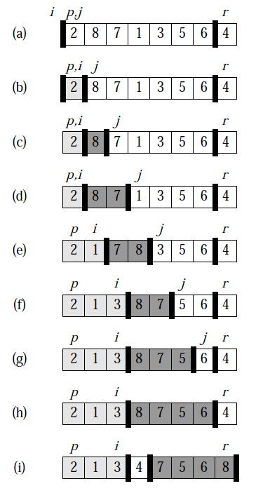
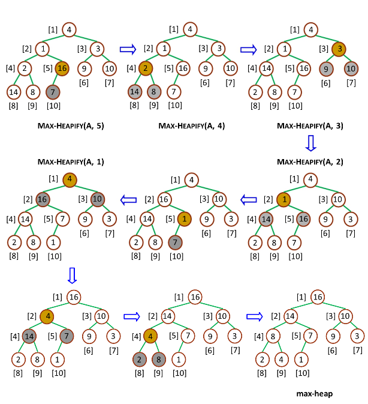

# 快排-二叉查找树-堆排序

#### 快速排序

**快速排序（QuickSort）**，是一个典型的**分治法（Divide and conquer）**，把一个序列分成两个子序列

1. 从数列中挑出一个元素，称为**“基准（pivot）“**。
2. 重新排序数列，所有比基准小的元素摆在基准前面，所有比基准值大的元素摆在基准后面。在这个分区结束之后，该基准就处于数列的中间位置。这个称为**分区(partition)**。
3. 递归地把两个子序列排序。

伪代码

```kotlin
function quicksort(q)
	var list less, pivotList, greater
	if length(q) <= 1 {
      return q
	} else {
      select a pivot value pivot from q
      for each x in q except the pivot element
      	if x < pivot then add x to less
      	if x >= pivot then add x to greater
      add pivot to pivotList
      return concatenate(quicksort(less), pivotList, quicksort(greater))
	}
```

还有一个原地分区版本，空间复杂度可以降低到 O(logn)

```kotlin
function partition(a, left, right, pivotIndex)
	pivotValue = a[pivotIndex]
	swap(a[pivotIndex], a[right])
	storeIndex = left
	for i form left to right -1
		if a[i] <= pivotValue
			swap(a[storeIndex], a[i])
			storeIndex++
	swap(a[right], a[storeIndex])
	return storeIndex

procedure quicksort(a, left, right)
	if right > left
		select a pivot value a[pivotIndex]
		pivotNewIndex = partition(a, left, right, pivotIndex)
		quicksort(a, left, pivotNewIndex -1)
		quicksort(a, pivotNewIndex + 1, right)
```

代码实现

迭代法：

```c
typedef struct _Range {
  int start, end;
} Range;

Range new_Range(int s, int e) {
  Range r;
  r.start = s;
  r.end = e;
  return r;
}

void swap(int *x, int *y) {
  int t = *x;
  *x = *y;
  *y = t;
}

void quick_sort(int arr[], const int len) {
  if(len <= 0) 
    return;
  Range r[len];
  int p = 0;
  r[p++] = new_Range(0, len - 1);
  while (p) {
    Range range = r[--p];
    if(range.start >= range.end)
      continue;
    int mid = arr[range.end];
    int left = range.start, right = range.end - 1;
    while (left < right) {
      while(arr[left] < mid && left < right)
        left++;
      while(arr[right] > mid && left < right)
        right++;
      swap(&arr[left], &arr[right]);
    }
    if (arr[left] >= arr[range.end])
      swap(&arr[left], &arr[range.end]);
    else 
      left++;
    r[p++] = new_Range(range.start, left-1);
    r[p++] = new_Range(left + 1, range.end);
  }
}
```

递归法

```c
void swap(int *x, int *y) {
  int t = *x;
  *x = *y;
  *y = t;
}

void quick_sort_recursive(int arr[], int start, int end) {
  if (start >= end)
    return;
  int mid = arr[end];
  int left = start, right = end - 1;
  while (left < right) {
    while (arr[left] < mid && left < right)
      left++;
    while (arr[right] >= mid && left < right)
      right--;
    swap(&arr[left], &arr[right]);
  }
  if(arr[left] >= arr[end]);
  else 
    left++;
  if(left) {
    quick_sort_recursive(arr, start, left -1);
  }
  quick_sort_recursive(arr, left + 1, end);
}

void quick_sort(int arr[], int len) {
  quick_sort_recursive(arr, 0, len -1);
}
```

图示



快排有两个竞争对手，分别是**二叉搜索树**和**堆排序**

#### 二叉搜索树

**二叉搜索树（Binary Search Tree）**是指，一颗空树或者具有下列性质的二叉树

1. 若任意节点的左子树不空，则左子树所有节点的值均小于它的根节点的值；
2. 若任意节点的右子树不空，则右子树所有节点的值均大于它的根节点的值；
3. 任意节点的左右子树也分别是二叉查找树；
4. 没有键值相等的节点。


二叉搜索树b中寻找x的过程为：

1. 若b是空树，则搜索失败，否则；
2. 若x等于b的根结点的值，则查找成功；否则；
3. 若x小于b的根结点的值，则搜索左子树；否则；
4. 查找右子树；

```c++
Status SearchBST(BiTree T, Key key, BiTree f, BiTree &p) {
  if (!T) {
    p = f;
    return false;
  }
  else if(key == T->data.key) {
    p = T;
    return true;
  }
  else if(key < T->data.key)
    return SearchBST(T->lchild, key, T, p);
  else 
    return SearchBST(T->rchild, key, T, p);
}
```


#### 堆排序

**堆排序（Heapsort）** 是指利用堆这种数据结构所设计的一种排序算法。堆是一种近似于完全二叉树的数据结构，并且满足：子结点的键值或索引总是小于（或者大于）它的父节点

**堆节点的访问：**

通常堆是通过一维数组来实现的。

- ​  父节点i的左子节点的位置在（2*i + 1)
- ​  父节点i的右子节点的位置在(2*i+2)
- ​  子结点i的父节点在位置floor((i-1)／2)


最大堆调整（Max_Heapify）: 将堆的末端子结点做调整，使得子结点永远小于父节点；

创建最大堆（Build_Max_Heap）：将堆的所有数据重新排序；

堆排序（HeapSprt）：移除位在第一个数据的根结点，并做最大堆调整的递归算法；

```java
public class HeapSort {
  private int[] arr;
  
  public HeapSort(int[] arr) {
    this.arr = arr;
  }
  
  public void sort() {
    int len = arr.length - 1;
    int beginIndex = (len - 1) >> 1;
    for (int i = beginIndex; i >= 0; i--) {
      maxHeapify(i, len);
    }
    
    for(int i = len; i > 0; i--) {
      swap(0, i);
      maxHeapify(0, i -1);
    }
  }
  
  private void swap(int i, int j) {
    int temp = arr[i];
    arr[i] = arr[j];
    arr[j] = temp;
  }
  
  private void maxHeapfiy(int index, int len) {
    int li = (index << 1) + 1;
    int ri = li + 1;
    int cMax = li;
    
    if(li > len) return;
    
    if(ri <= len && arr[ri] > arr[li])
      cMax = ri;
    if(arr[cMax] > arr[index]) {
      swap(cMax, index);
      maxHeapify(cMax , len);
    }
  }
}
```

图示 — 建堆



图示 堆排序


