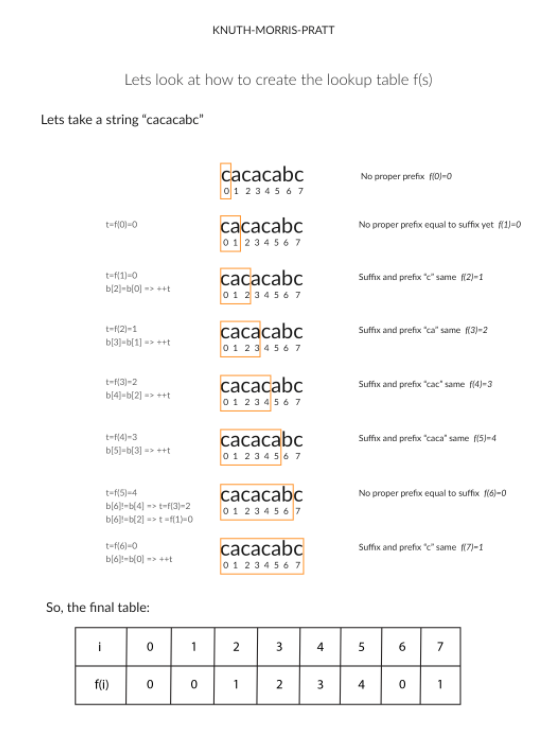

# Shortest Palindrome

[Shortest Palindrome](https://leetcode.com/problems/shortest-palindrome/description/)

> 
>
> 通过在字符串   **S** 前面增加字符，来让它变成**回文** ，找到并返回这样的最短的回文。
>
> For example:
>
> Given `"aacecaaa"`, return `"aaacecaaa"`.
>
> Given `"abcd"`, return `"dcbabcd"`.
>
> 

核心是找到回文的部分

```JAVA
//简单粗暴的遍历
public Stirng shortestPalindrom(String s) {
  int n = s.length();
  String rev = new StringBuilder(s).reverse().toString();
  for(int i = 0; i < n; i++) {
    if(s.subString(0, n - i).equals(rev.substring(i))) {
      return rev.substring(0,i) + s;
    }
  }
  return "";
}
```

```JAVA
//双指针
public String shorestPalindrom(String s) {
  int n = s.length();
  int i = 0;
  for(int j = n -1; j >= 0; j--) {
    if(s.charAt(i) == s.charAt(j)) {
      i++;
    }
  }
  if(i == n) {
    //找到了回文
    return s;
  }
  //回文的前后部分以及反转，并且把前后和反转加上
  StringBuilder revsb = new StringBuilder(s.substring(i));
  String rev = revsb.reverse().toString();
  return rev + shortestPalindrom(s.substring(0, i)) + s.substring(i);
  
}
```



```java
//KMP
//KMP使用一个 列表存储相等的前缀和后缀的长度，通过这个，来计算往前移动的距离

public String shorestPalindrom(String s) {
 	int n = s.length();
  String rev = new StringBuilder(s).reverse().toString();
  String sNew = s + "#" + rev;
  int nNew = sNew.length();
  int[] f = new int[nNew];
  for(int i = 0; i< nNew; i++) {
    int t = f[i - 1];
    while(t > 0 && sNew.charAt(i) != sNew.charAt(t)) {
      t = f[t - 1];
    }
    if(sNew.charAt(i) == sNew.charAt(t)) {
      ++t;
    }
    f[i] = t;
  }
  return rev.substring(0, n - f[nNew - 1]) + s;
}
```