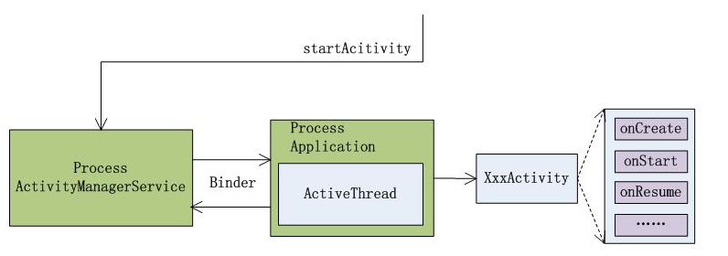
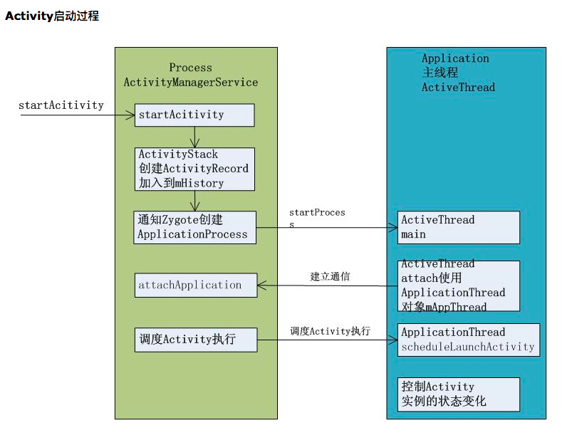

# Activity

#### Activity的启动过程


大部分行为都出现在 ActivityStack.java类中

我们可以通过配置两个应用程序具有相同的uid + process的，或者在AndroidManifest.xml配置文件的application标签或者activity标签中显式制定相同的process属性，这样，**不同的应用程序也可以在同一个进程中启动**。

- Activity管理的核心是ActivityManagerService，是一个独立的进程；
- ActivityThread是每一个应用程序所在进程的主线程，循环的消息处理；
- ActivityThread与ActivityManagerService的通信属于进程间通信，使用binder机制；
- **一个应用程序中所有的Activity只有一个ActivityThread属于一个Process；**





几个关键的类：

**ActivityManagerService，Activity，ActivityStack，ActivityThread**；

流程：

- 使用代理模式启动到ActivityManagerService中执行；
- 创建ActivityRecord到mHistory中；
- 通过socket通信到Zygote相关类创建process；
- 通过ApplicationThread与ActivityManagerService建立通信；
- ActivityManagerService通知ActivityThread启动Activity创建；
- ActivityThread创建Activity加入到mActivities中并开始调度Acitivity执行；


#### AndroidManifest 不注册Activity的话怎么启动，已经我设置的是从A Activity 启动B Activity的代码，怎么让他把C启动起来

先说一下Activity启动的一些关键点

- ActivityManagerNative继承了IBinder，实现了IActivityManager，是AMS的父类；
- ActivityManagerService就是AMS，系统中的重要服务，管理Activity生命周期；
- ActivityManagerProxy同样继承了IBinder，实现了IActivityManager，是AcitivityManagerNativie的内部类，是AMS在应用中的代理；
- ActivityStack AMS调用它对Activity进行管理，新版本已经抽取到了ActivityStackSupervisor；
- ActivityThread 每个应用的入口，它的main是应用的起点，里面维护了应用主线程；
- Instrumentation，协助ActivityThread完成一些琐碎的工作，比如启动Activity，最终由它去调用AMS；
- ApplicationThread，其实是一个Binder，ActivityThread使用它来跟AMS通信，服务端在ActivityThread，AMS获取的是它的代理。

在Instrumentation的函数 checkStartActivityResult中抛出ActivityNotFound异常；

我们先创建两个Activity，StubActivity在manifest注册，然后，TargetActivity，不注册。

```java
Class<?> activityManagerNativeClass = Class.forName("android.app.ActivityManagerNative");
Field gDefaultField = activityManagerNativeClass.getDeclaredField("gDefault");
gDefaultField.setAccessible(true);

Object gDefault = gDefaultField.get(null);
Class<?> singleton = Class.forName("android.util.Singleton");
Field mInstanceField = singleton.getDeclaredField("mInstance");
mInstanceField.setAccessible(true);

Object rawIActivityManager = mInstanceField.get(gDefault);

Class<?> iActivityManagerInterface = Class.forName("android.app.IActivityManager");
Object proxy = Proxy.newProxyInstance(Thread.currentThread().getContextClassLoader(),
                                     new Class<?>[] {iActivityManagerInterface}, new IActivityManagerHandler(rawIActivityManager));
mInstanceField.set(gDefault, proxy);

public Object invoke(Object proxy, Method method, Object[] args) throws Throwable {
  if("startActivity".equals(method.getName())) {
    Intent raw;
    int index = 0;
    
    for (int i = 0; i < args.length; i++) {
      if(args[i] instanceof Intent) {
        index = i;
        break;
      }
    }
    raw = (Intent) args[index];
    Intent newIntent = new Intent();
    Stirng stubPackage = "com.stub.app";
    
    ComponentName componentName = new ComponentName(stubPackage,StubActivity.class.getName());
    newIntent.setComponent(componentName);
    
    newIntent.putExtra(AMSHookerHelper.EXTRA_TARGET_INTENT, raw);
    args[index] = newIntent;
    
    return method.invoke(mBase, args);
  }
  
  return method.invoke(mBase, args);
}

Class<?> activityThreadClass = Class.forName("android.app.ActivityThread");
Field currentActivityThreadField = activityThreadClass.getDeclaredField("sCurrentActivityThread");
currentActivityThreadField.setAccessable(true);
Object currentActivityThread = currentActivityThreadField.get(null);

Field mHField = activityThreadClass.getDeclaredField("mH");
mHField.setAccessible(true);
Handler mH = (Handler) mHField.get(currentActivityThread);
Field mCallBackField = Handler.class.getDeclaredField("mCallback");
mCallBackField.setAccessible(true);
mCallBackField.set(mH, new ActivityThreadHandlerCallback(mH));
```
```java
   class ActivityThreadHandlerCallback implements Handler.Callback {

 Handler mBase;
 public ActivityThreadHandlerCallback(Handler base) {
   mBase = base;
 }
 
 @Override
 public boolean handleMessage(Message msg) {
   switch (msg.what) {
     case 100:// LAUNCH_ACTIVITY
       handleLaunchActivity(msg);
       break;
   }
   mBase.handeMessage(msg);
   return true;
 }
 
 private void handleLaunchActivity(Message msg) {
   Object obj = msg.obj;
   try {
     Field intent = obj.getClass().getDeclaredField("intent");
     intent.setAccessible(true);
     Intent raw = (Intent) intent.get(obj);
     Intent target = raw.getParcelableExtra(AMSHookHelper.EXTRA_TARGET_INTENT);
     raw.setComponent(target.getComponent());
   } catch(Exception e) {
     
   }
 }
```


####AMS和PMS

  两个最重要的组件 **ActivityManagerService** 和 **PackageManagerService**

  ActivityManagerService:

- startActivity最终调用了AMS的startActivity系列放啊， 实现了Activity的启动：Activity的生命周期回调，也是在AMS中完成；
  - startService, bindService最终调用了AMS的startService和bindService方法；
  - 动态广播的注册和接收在AMS中完成（静态广播在PMS中完成）；
  - getContentResolver最终从AMS的getContentProvider获取ContentProvider；


  PMS 权限校验，Apk meta信息获取，四大组件信息获取等重要功能。

  AMS和PMS就是以Binder的方式提供给应用程序使用的系统服务。


#### startActivity

  startActivity的两种使用形式：

1. 直接调用**Context类的startActivity**方法；这种方法启动的Activity没有Activity栈，不能以standard方式启动，**必须加上FLAG_ACTIVITY_NEW_TASK**。
2. 调用被**Activity重载过的startActivity**方法，我们在Activity中直接调用的方法就是这个。


# //TODO 生命周期相关的问题

### Activity 隐藏标题栏和状态栏

```java
//这段代码必须放在setContentview之前执行，否则会抛出异常
//并且继承AppCompatActivity的App并不能通过这个方式隐藏掉
this.requestWindowFeature(Window.FEATURE_NO_TITLE);
```

```java
//这段代码隐藏了状态栏
View decorView = getWindow().getDecorView();
int uiOptions = View.SYSTEM_UI_FLAG_HIDE_NAVIGATION
        | View.SYSTEM_UI_FLAG_FULLSCREEN;
decorView.setSystemUiVisibility(uiOptions);
```

**android:theme="@android:style/Theme.NoTitleBar.Fullscreen"这行代码如果在Application中配置的话，整个APP的Activity都只能是继承自Activity，不能是AppCompatActivity，因为AppCompatActivity下的Theme只能是ActionBar样式的；**

```xml
<!--继承了AppCompatActivity的使用这种方法隐藏标题栏-->
<application    
   android:icon="@mipmap/ic_launcher"    
   android:label="@string/app_name"    
   android:theme="@style/Theme.AppCompat.Light.NoActionBar"
>
```


### setContentView源码


主要的调用流程的都在下面了，细节不解释了，大家自己看代码吧


```java
//AppCompatActivity

@Override
public void setContentView(@LayoutRes int layoutResID) {
    getDelegate().setContentView(layoutResID);
}

//AppCompatDelegate
public abstract void setContentView(@LayoutRes int resId);

//AppCompatDelegateImplV9
@Override
public void setContentView(int resId) {
   ensureSubDecor();
   ViewGroup contentParent = (ViewGroup) mSubDecor.findViewById(android.R.id.content);
   contentParent.removeAllViews();
   LayoutInflater.from(mContext).inflate(resId, contentParent);
   mOriginalWindowCallback.onContentChanged();
}


private void ensureSubDecor() {
    if (!mSubDecorInstalled) {
      mSubDecor = createSubDecor();

      // If a title was set before we installed the decor, propagate it now
      CharSequence title = getTitle();
      if (!TextUtils.isEmpty(title)) {
        onTitleChanged(title);
      }

      applyFixedSizeWindow();

      onSubDecorInstalled(mSubDecor);

      mSubDecorInstalled = true;

      // Invalidate if the panel menu hasn't been created before this.
      // Panel menu invalidation is deferred avoiding application onCreateOptionsMenu
      // being called in the middle of onCreate or similar.
      // A pending invalidation will typically be resolved before the posted message
      // would run normally in order to satisfy instance state restoration.
      PanelFeatureState st = getPanelState(FEATURE_OPTIONS_PANEL, false);
      if (!isDestroyed() && (st == null || st.menu == null)) {
        invalidatePanelMenu(FEATURE_SUPPORT_ACTION_BAR);
      }
    }
}

private ViewGroup createSubDecor() {
  TypedArray a = mContext.obtainStyledAttributes(R.styleable.AppCompatTheme);

  if (!a.hasValue(R.styleable.AppCompatTheme_windowActionBar)) {
    a.recycle();
    throw new IllegalStateException(
      "You need to use a Theme.AppCompat theme (or descendant) with this activity.");
  }

  if (a.getBoolean(R.styleable.AppCompatTheme_windowNoTitle, false)) {
    requestWindowFeature(Window.FEATURE_NO_TITLE);
  } else if (a.getBoolean(R.styleable.AppCompatTheme_windowActionBar, false)) {
    // Don't allow an action bar if there is no title.
    requestWindowFeature(FEATURE_SUPPORT_ACTION_BAR);
  }
  if (a.getBoolean(R.styleable.AppCompatTheme_windowActionBarOverlay, false)) {
    requestWindowFeature(FEATURE_SUPPORT_ACTION_BAR_OVERLAY);
  }
  if (a.getBoolean(R.styleable.AppCompatTheme_windowActionModeOverlay, false)) {
    requestWindowFeature(FEATURE_ACTION_MODE_OVERLAY);
  }
  mIsFloating = a.getBoolean(R.styleable.AppCompatTheme_android_windowIsFloating, false);
  a.recycle();

  // Now let's make sure that the Window has installed its decor by retrieving it
  mWindow.getDecorView();

  final LayoutInflater inflater = LayoutInflater.from(mContext);
  ViewGroup subDecor = null;


  if (!mWindowNoTitle) {
    if (mIsFloating) {
      // If we're floating, inflate the dialog title decor
      subDecor = (ViewGroup) inflater.inflate(
        R.layout.abc_dialog_title_material, null);

      // Floating windows can never have an action bar, reset the flags
      mHasActionBar = mOverlayActionBar = false;
    } else if (mHasActionBar) {
      /**
                 * This needs some explanation. As we can not use the android:theme attribute
                 * pre-L, we emulate it by manually creating a LayoutInflater using a
                 * ContextThemeWrapper pointing to actionBarTheme.
                 */
      TypedValue outValue = new TypedValue();
      mContext.getTheme().resolveAttribute(R.attr.actionBarTheme, outValue, true);

      Context themedContext;
      if (outValue.resourceId != 0) {
        themedContext = new ContextThemeWrapper(mContext, outValue.resourceId);
      } else {
        themedContext = mContext;
      }

      // Now inflate the view using the themed context and set it as the content view
      subDecor = (ViewGroup) LayoutInflater.from(themedContext)
        .inflate(R.layout.abc_screen_toolbar, null);

      mDecorContentParent = (DecorContentParent) subDecor
        .findViewById(R.id.decor_content_parent);
      mDecorContentParent.setWindowCallback(getWindowCallback());

      /**
                 * Propagate features to DecorContentParent
                 */
      if (mOverlayActionBar) {
        mDecorContentParent.initFeature(FEATURE_SUPPORT_ACTION_BAR_OVERLAY);
      }
      if (mFeatureProgress) {
        mDecorContentParent.initFeature(Window.FEATURE_PROGRESS);
      }
      if (mFeatureIndeterminateProgress) {
        mDecorContentParent.initFeature(Window.FEATURE_INDETERMINATE_PROGRESS);
      }
    }
  } else {
    if (mOverlayActionMode) {
      subDecor = (ViewGroup) inflater.inflate(
        R.layout.abc_screen_simple_overlay_action_mode, null);
    } else {
      subDecor = (ViewGroup) inflater.inflate(R.layout.abc_screen_simple, null);
    }

    if (Build.VERSION.SDK_INT >= 21) {
      // If we're running on L or above, we can rely on ViewCompat's
      // setOnApplyWindowInsetsListener
      ViewCompat.setOnApplyWindowInsetsListener(subDecor,
                                                new OnApplyWindowInsetsListener() {
                                                  @Override
                                                  public WindowInsetsCompat onApplyWindowInsets(View v,
                                                                                                WindowInsetsCompat insets) {
                                                    final int top = insets.getSystemWindowInsetTop();
                                                    final int newTop = updateStatusGuard(top);

                                                    if (top != newTop) {
                                                      insets = insets.replaceSystemWindowInsets(
                                                        insets.getSystemWindowInsetLeft(),
                                                        newTop,
                                                        insets.getSystemWindowInsetRight(),
                                                        insets.getSystemWindowInsetBottom());
                                                    }

                                                    // Now apply the insets on our view
                                                    return ViewCompat.onApplyWindowInsets(v, insets);
                                                  }
                                                });
    } else {
      // Else, we need to use our own FitWindowsViewGroup handling
      ((FitWindowsViewGroup) subDecor).setOnFitSystemWindowsListener(
        new FitWindowsViewGroup.OnFitSystemWindowsListener() {
          @Override
          public void onFitSystemWindows(Rect insets) {
            insets.top = updateStatusGuard(insets.top);
          }
        });
    }
  }

  if (subDecor == null) {
    throw new IllegalArgumentException(
      "AppCompat does not support the current theme features: { "
      + "windowActionBar: " + mHasActionBar
      + ", windowActionBarOverlay: "+ mOverlayActionBar
      + ", android:windowIsFloating: " + mIsFloating
      + ", windowActionModeOverlay: " + mOverlayActionMode
      + ", windowNoTitle: " + mWindowNoTitle
      + " }");
  }

  if (mDecorContentParent == null) {
    mTitleView = (TextView) subDecor.findViewById(R.id.title);
  }

  // Make the decor optionally fit system windows, like the window's decor
  ViewUtils.makeOptionalFitsSystemWindows(subDecor);

  final ContentFrameLayout contentView = (ContentFrameLayout) subDecor.findViewById(
    R.id.action_bar_activity_content);

  final ViewGroup windowContentView = (ViewGroup) mWindow.findViewById(android.R.id.content);
  if (windowContentView != null) {
    // There might be Views already added to the Window's content view so we need to
    // migrate them to our content view
    while (windowContentView.getChildCount() > 0) {
      final View child = windowContentView.getChildAt(0);
      windowContentView.removeViewAt(0);
      contentView.addView(child);
    }

    // Change our content FrameLayout to use the android.R.id.content id.
    // Useful for fragments.
    windowContentView.setId(View.NO_ID);
    contentView.setId(android.R.id.content);

    // The decorContent may have a foreground drawable set (windowContentOverlay).
    // Remove this as we handle it ourselves
    if (windowContentView instanceof FrameLayout) {
      ((FrameLayout) windowContentView).setForeground(null);
    }
  }

  // Now set the Window's content view with the decor
  mWindow.setContentView(subDecor);

  contentView.setAttachListener(new ContentFrameLayout.OnAttachListener() {
    @Override
    public void onAttachedFromWindow() {}

    @Override
    public void onDetachedFromWindow() {
      dismissPopups();
    }
  });

  return subDecor;
}


//LayoutInflater
public View inflate(XmlPullParser parser, @Nullable ViewGroup root, boolean attachToRoot) {
        synchronized (mConstructorArgs) {
            Trace.traceBegin(Trace.TRACE_TAG_VIEW, "inflate");

            final Context inflaterContext = mContext;
            final AttributeSet attrs = Xml.asAttributeSet(parser);
            Context lastContext = (Context) mConstructorArgs[0];
            mConstructorArgs[0] = inflaterContext;
            View result = root;

            try {
                // Look for the root node.
                int type;
                while ((type = parser.next()) != XmlPullParser.START_TAG &&
                        type != XmlPullParser.END_DOCUMENT) {
                    // Empty
                }

                if (type != XmlPullParser.START_TAG) {
                    throw new InflateException(parser.getPositionDescription()
                            + ": No start tag found!");
                }

                final String name = parser.getName();
                
                if (DEBUG) {
                    System.out.println("**************************");
                    System.out.println("Creating root view: "
                            + name);
                    System.out.println("**************************");
                }

                if (TAG_MERGE.equals(name)) {
                    if (root == null || !attachToRoot) {
                        throw new InflateException("<merge /> can be used only with a valid "
                                + "ViewGroup root and attachToRoot=true");
                    }

                    rInflate(parser, root, inflaterContext, attrs, false);
                } else {
                    // Temp is the root view that was found in the xml
                    final View temp = createViewFromTag(root, name, inflaterContext, attrs);

                    ViewGroup.LayoutParams params = null;

                    if (root != null) {
                        if (DEBUG) {
                            System.out.println("Creating params from root: " +
                                    root);
                        }
                        // Create layout params that match root, if supplied
                        params = root.generateLayoutParams(attrs);
                        if (!attachToRoot) {
                            // Set the layout params for temp if we are not
                            // attaching. (If we are, we use addView, below)
                            temp.setLayoutParams(params);
                        }
                    }

                    if (DEBUG) {
                        System.out.println("-----> start inflating children");
                    }

                    // Inflate all children under temp against its context.
                    rInflateChildren(parser, temp, attrs, true);

                    if (DEBUG) {
                        System.out.println("-----> done inflating children");
                    }

                    // We are supposed to attach all the views we found (int temp)
                    // to root. Do that now.
                    if (root != null && attachToRoot) {
                        root.addView(temp, params);
                    }

                    // Decide whether to return the root that was passed in or the
                    // top view found in xml.
                    if (root == null || !attachToRoot) {
                        result = temp;
                    }
                }

            } catch (XmlPullParserException e) {
                final InflateException ie = new InflateException(e.getMessage(), e);
                ie.setStackTrace(EMPTY_STACK_TRACE);
                throw ie;
            } catch (Exception e) {
                final InflateException ie = new InflateException(parser.getPositionDescription()
                        + ": " + e.getMessage(), e);
                ie.setStackTrace(EMPTY_STACK_TRACE);
                throw ie;
            } finally {
                // Don't retain static reference on context.
                mConstructorArgs[0] = lastContext;
                mConstructorArgs[1] = null;

                Trace.traceEnd(Trace.TRACE_TAG_VIEW);
            }

            return result;
        }
    }

```


