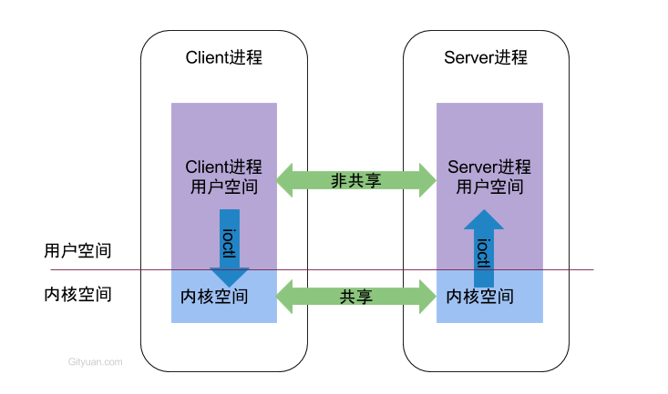
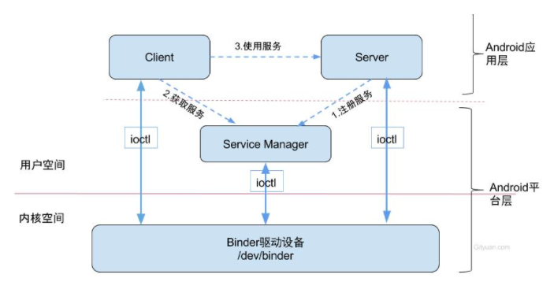

# Binder

#### Binder原理

Binder 是 Android系统进程间通信（IPC）方式之一。

Binder相对于传统的SOCKET方式，数据拷贝只需要一次，而管道，消息队列，socket都需要两次。而且安全性高，为发送方添加UID／PID身份，即支持实名Binder也支持匿名Binder，安全性更高

Binder通信的4个角色：

client进程：使用服务的进程；

server 进程：提供服务的进程；

ServiceManager进程：ServiceManager的作用是将字符形式的Binder名字转化为Client中对该Binder的引用，使得Client能够通过Binder名字获得对server中Binder实体的引用。

上面3个处于用户空间

Binder驱动：驱动负责进程之间Binder通信的建立，Binder在进程之间传递，Binder引用计数管理，数据包在进程之间的传递和交互等一系列底层支持。

驱动在内核空间

运行机制：

​	注册服务（addService）—> 获取服务（getService）—>使用服务

#### Linux现有的所有进程间的IPC机制

- 管道：在创建时分配一个page大小的内存，缓存区大小比较有限；
- 消息队列：信息复制两次，额外的CPU消耗；不适合频繁或者信息量大的通信；
- 共享内存：无须复制，共享缓冲区直接附加到进程的虚拟地址空间，速度快；但是进程间的同步问题操作系统无法实现，必须各进程利用同步工具解决；
- 套接字：作为更通用的接口传输效率低，主要用于不通机器或跨网络的通信；
- 信号量：基本锁机制，防止某进程正在访问共享资源时，其他进程也访问该资源。因此，主要作为进程间以及同一进程进程内不同线程之间的同步机制；
- 信号：不适用于信息交换，更适用于进程中断控制，比如非法内存访问，杀死某个进程；
- ​

#### Android为什么用Binder

- 性能：Binder数据拷贝只需要一次，只有共享内存方式一次内存拷贝都不需要；

- 稳定性：Binder是基于C/S架构，通过Service来完成调度，而共享内存需要自己考虑同步的问题。

- 安全性：传统IPC无法获得对方进程可靠的UID／PID，无法鉴别对方身份，传统方法无任何保护措施，完全由上层协议来确保；

  Android为每个安装好的应用程序分配了自己的UID，作为鉴别进程身份的重要标志，由于Binder的C／S架构，Android系统对外只暴露Client端，Client端将任务发送给Server端，Server端会根据权限控制策略，判断UID／PID是否满足访问权限。

  传统IPC只能由用户在数据包中填入UID／PID；另外，传统IPC访问接入点是开放的，无法建立私有通道。

- 从语言层面

  Binder对象是一个可以跨进程引用的对象，他的实体位于一个进程中，而它的引用却遍布于系统的各个进程中，可以从一个进程传给其他进程，让大家访问同一个Server。

#### 流程：

- 注册（addService）Server进程要先注册Service到ServiceManager。
- 获取（getService）Client使用某个Service前，须向ServiceManager中获取相应的Service。
- 使用  Client根据得到的Service信息建立与Service进程通信的通路，然后就可以直接与Service交互。

#### ServiceManger启动：

ServiceManger集中管理系统内的所有服务，通过权限控制进程是否有权注册服务，通过字符串名称来查找对应的Service；由于ServiceManger进程建立跟所有向其注册服务的死亡通知，那么当服务所在的进程死亡后，会只需告知ServiceManger。

- 打开binder驱动，并调用mmap() 方法分配 128K的内存映射空间：binder_open
- 通知binder驱动使其成为守护进程：binder_become_context_manager
- 验证selinux权限，判断进程是否有权注册或查看指定服务；
- 进入循环状态，等待Client端的请求：binder_loop
- 注册服务的过程，根据服务名称，但同一个服务已注册，重新注册前会先移除之前的注册信息；
- 死亡通知：当binder所在的进程死亡后，会调用binder_release方法，然后调用binder_node_release，这个过程便会发出死亡通知的回调。

ServiceManger最核心的两个功能为查询和注册服务。

#### Binder相关的类：

- ServiceManager：通过getIServiceManager方法获取的是ServiceManagerProxy对象；addService和getService实际工作都是ServiceManagerProxy的相应方法来处理；
- ServiceManagerProxy：其成员变量mRemote指向BinderProxy对象，ServiceManagerProxy的addService,getService方法最终是交由mRemote来完成。
- ServiceManagerNative ：其方法asInterface返回的是ServiceManagerProxy对象，ServiceManager借助这个类找到ServiceManagerProxy
- Binder：其成员变量mObject和方法execTransact用于native方法；
- BinderInternal：内部又一个GcWatcher，用于处理和调试与Binder相关的垃圾回收；
- IBinder：接口中常量FLAG_ONEWAY：没设置就是阻塞的，如果设置了就是非阻塞；

#### 总结：

- 从IPC角度，Binder是Android的一种跨进程通信的方式。
- 从Android Driver层：Binder可以理解为一种虚拟的物理设备，它的设备驱动是/dev/binder；
- 从Android Native层：Binder是创建Service Manager以及BpBinder／BBinder模型，搭建与bidner驱动的桥梁；
- Android FrameWork层：Binder是各种Manager（ActivityManager，WindowManager等等）和相应的xxManagerService的桥梁；
- 从Android App层，Binder是客户端和服务端进行通信的媒介，当bindService的时候，服务端返回一个包含了服务端业务调用的Binder对象，通过这个Binder对象，客户端可以获取服务端提供的服务或者数据，这里的服务包括普通服务和基于AIDL的服务。

#### Binder的路由原理：

BpBinder发送端，根据**handler**，在当前**binder_proc**中找到相应的**binder_ref**；

再由**binder_ref**找到目标的**binder_node**实体；

由目标的**binder_node**再找到目标进程**binder_proc**。

简单地方式是直接把**binder_transaction**节点插入到**binder_proc**的**todo**队列中，完成传输过程。