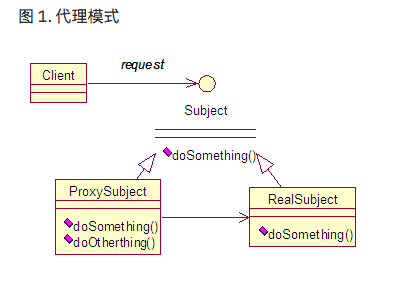

# 动态代理

Java实现动态代理的缺点：因为Java的单继承特性，只能针对接口创建代理类，不能针对类创建代理类。





- java.lang.reflect.Proxy：动态代理机制的主类

  ```java
  //用于获取指定代理对象所关联的调用处理器
  static InvovationHanlder getInvovationHandler(Object proxy);

  //用于获取关联于指定类装载器和一组接口的动态代理类的类对象
  static Class getProxyClass(ClassLoader loader, Class[] interface);

  //该方法用于判断指定类对象是否是一个动态代理类
  static boolean isProxyClass(Class cl);

  //用于为制定装载器，一组接口以及调用处理器生成动态代理类实例
  static Object newProxyInstance(ClassLoader loader, Class[] interfaces, InvocationHandler h)
  ```

- java.lang.reflect.InvocationHandler: 调用处理器接口，自定义了一个invoke方法，用于集中处理动态代理类对象上的方法调用，通常该方法实现对委托类的代理访问。

  ```java
  //负责动态代理类上所有方法调用。第一个参数即是代理类实例，第二个参数是被调用的方法对象，第三个参数是方法调用参数，调用处理器根据这三个参数进行预处理或分派到委托类实例上发射执行。
  Object invoke(Object proxy, Method method, Object[] args);
  ```

Java动态代理，具体有如下四个步骤：

- 通过实现InvocationHandler接口创建自己的调用处理器；

- 通过为Proxy类指定ClassLoader对象和一组interface 来创建动态代理类；

- 通过反射机制获得动态代理类的构造函数，其唯一参数类型是调用处理器接口类型；

- 通过构造函数创建动态代理实例，构造时调用处理器对象作为参数被传入；

  ```java
  InvocationHandler handler = new InvocationHandlerImpl(...);

  Interface proxy = (Interface) Proxy.newProxyInstance(classLoader, new Class[] {Interface.class}, handler);
  ```


一个简单的例子：

```java
public interface Operate {
  public void operate1();
}

public class OperateImpl implements Operate {
  public void operate1() {
    lllllll
  }
}

public class TimingInvocationHandler implements InvocationHandler {
  private Object target;
  
  public TimingInvocationHandler() {}
  
  public IimgingInvocationHandler(Object target) {
    this.target = target;
  }
  
  @Override
  public Object invoke(Object proxy, Method method, Object[] args) throws Throwable {
    //my funcion
    Object object = method.invoke(target, args);
    //my function
    return object;
  }
}

publc class Main{
  public static void main(String[] args) {
    TimingInvocationHandler timingInvocationHandler = new TimingInvocationHandler(new OperateImpl());
    Operate operate = (Operate) (Proxy.newProxyInstance(Operate.class.getClassLoader(), new Class[] {Operate.class}, timingInvocationHandler));
    operate.operate1();
  }
}
```


### 使用实例，Hook系统剪切板

```java
  1. 伪造剪切板服务，用动态代理的方式Hook掉 hasPrimaryClip 和 getPrimaryClip;
   
  //IBinder对象实际上是一个裸Binder代理对象，它只与驱动打交道的能力，需要asInterface 方法返回IClipboard.Stub.Proxy类对象通过操纵这个裸BinderProxy对象从而实现了具体的IClipboard接口定义的操作
  public class BinderHookHandler implements InvocationHandler {
    
    private static final String TAG = "BinderHookHandler";
    
    //原始的Service对象(IInterface)
    Object base;
    
    public BinderHookHandler(IBinder base, Class<?> stubClass) {
      try {
        Method asInterfaceMethod = stubClass.getDeclaredMethod("asInterface", IBinder.class);
        this.base = asInterfaceMethod.invoke(null, base);
      } catch (Exception e) {
        throw new RuntimeException("hooked failed");
      }
    }
    
    @TargetApi(Build.VERSION_CODES.HONEYCOMB)
    @Override
    public Object invoke(Object proxy, Method method, Object[] args) throws Throwable {
      
      if("getPrimaryClip".equals(method.getName())) {
        return ClipData.newPlainText(null, "hooked");
      }
      
      if("hasPrimaryClip".equals(method.getName())) {
        return true;
      }
      
      return method.invoke(base, args);
    }
  }

  2. 伪造IBinder，第一步我们已经伪造好了对象，下一步就是要asInterface返回我们伪造的对象

  public class BinderProxyHookHandler implements InvocationHandler {
    
    private static final String TAG = "BinderProxyHookHandler";
    
    //这个大部分情况，是一个BinderProxy对象，只有当Service和我们在同一个进程的时候才是Binder本地对象，然而不可能。
    IBinder base;
    
    Class<?> stub;
    
    Class<?> iinterface;
    
    public BinderProxyHookHandler(IBinder base) {
      this.base = base;
      try {
        this.stub = Class.forName("android.content.IClipboard$Stub");
        this.iinterface = Class.forName("android.content,IClipboard");
      } catch(ClassNotFoundException e) {
        e.printStackTrace();
      } 
    }
    
    @Override
    public Object invoke(Object proxy, Method method, Object[] args) throws Throwable {
      if("queryLocalInterface".equals(method.getName())) {
        /*
        这里直接返回真正被Hook掉的Service接口，因为我们接管了 asInterface方法的作用，因此必须是一个完整的asInterface过的IInterface对象，既要处理本地对象，也要处理代理对象，这只是一个Hook点而已，他原始的含义已经被我们重定义，因为我们会永远确保这个方法不返回null，让IClipboard.Stub.asInterface 永远走到if语句的else分支里面。
        */
        
        return Proxy.newProxyInstance(proxy.getClass().getClassLoader(), new Class[] {IBinder.class, IInterface.class, this.iinterface
  }, new BinderHookHandler(base, stub));
      }
      return method.invoke(base, args);
    }
  }


  3. 替换ServiceManager 的IBinder对象

  final String CLIPBOARD_SERVICE = "clipboard";

  //下面的代码，ServiceManager.getService("clipboard");

  Class<?> serviceManager = Class.forName("android.os.ServiceManager");
  Method getService = serviceManager.getDeclaredMethod("getService", String.class);

  IBinder rawBinder = (IBinder) getService.invoke(null, CLIPBOARD_SERVICE);
  //Hook掉这个Binder代理对象的queryLocalInterface，然后在queryLocalInterface 返回一个IInterface对象。
  IBinder hookedBinder = (IBinder) Proxy.newProxyInstance(serviceManager.getClassLoader(), 
                                                          new Class<?>[] {IBinder.class}, 
                                                          new BinderProxyHookHandler(rawBinder));

  //把这个hook过的Binder代理对象放进ServiceManager的cache里面，以后查询的时候，会优先查询缓存里面的Binder，即我们修改过的Binder。
  Field cacheField = serviceManager.getDeclaredField("sCache");
  chacheField.setAccessible(true);
  Map<String, IBinder> cahce = (Map) cacheField.get(null);
  cache.put(CLIPBOARD_SERVICE, hookedBinder);
```