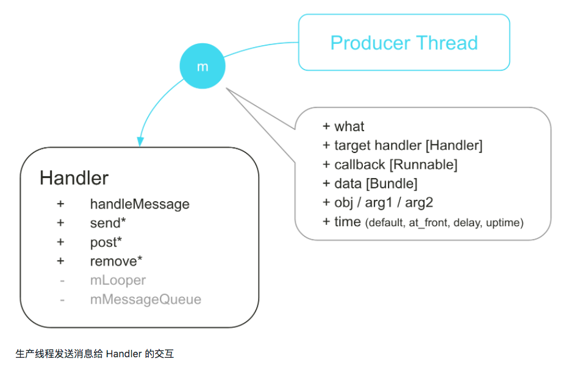
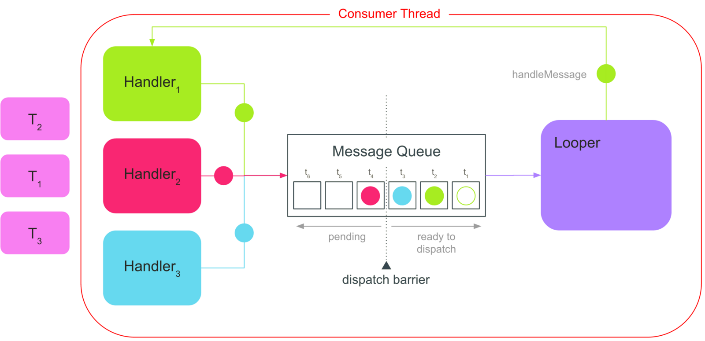

# Message,Handler,HandlerThread

##### Activity.runOnUiThread的实现

直接上代码：mHandler直接post runnable

```java
public final void runOnUiThread(Runnable action) {
  if(Thread.currentThread() != mUiThread) {
    mHandler.post(action);
  } else {
    action.run();
  }
}
```


### Handler：

​	Handler

​	Message

​	Message Queue

​	Looper

没有指定Looper的Handler是无法工作的，因为它无法将消息放到消息队列中

同一个线程中的多个Handler分享一个同样的消息队列，因为他们分享的是同一个Looper对象。

Message是容纳任意数据的容器，生产线程发送消息给Handler，Handler将消息加入到消息队列中。三个重要的参数 what， time， target。

消息从消息池中获取得到，方法中提供的参数会放到消息体的对应字段中。Handler同样可以设置消息的目标为其自身。



MessageQueue 是一个消息体对象的无界的LinkedList集合。它按照时序将消息插入队列，最小的时间戳将会被首先处理。

存在的问题：

Handler经常与一些UI组件相关联，而这些UI组件通常持有Activity的引用。会导致内存的泄漏。

在销毁Activity之后，Handler应当可以被垃圾回收，然而当创建了一个消息对象后，它也会持有对Handler的引用：

```java
private boolean enqueueMessage(MessageQueue queue, Message msg, long uptimeMillis) {
  msg.target = this;
  if(mAsynchronous) {
    msg.setAsynchronous(true);
  }
  return queue.enqueueMessage(msg, uptimeMillis);
}
```

所有被发送到Handler的消息最终都会触发enqueueMessage方法。注意到**Handler的引用被显式地赋给了msg.target，以此来告诉Looper对象当消息从消息队列出队时，选择哪一个Handler来对其进行处理**。

**主线程的Looper对象在程序的生命周期内一直存在**。因此，消息中持有的对Handler的引用会一直维持到该消息被消息队列回收之前。

通过结合使用弱引用和静态类修饰符可以阻止Handler导致的Activity泄漏。当Activity被销毁的时候，弱引用允许垃圾回收器回收想要留存的对象（Activity），在Handler内部类前加入静态修饰符可以阻止对外部类持有隐式引用。

```java
static class UIHanlder extends Handler {
  private final WeakReference<ImageFetcherActivity> mActivityRef;
  
  UIHandler(ImageFetcherActivity activity) {
    mActivityRef = new WeakReference(activity);
  }
  
  @Override
  public void handlerMessage(Message msg) {
    final ImageFetcherActivity activity = mActivityRef.get();
    if(activity == null || activity.isFinishing() || activity.isDestoryed()) {
      return;
    }
    
    switch(msg.what) {
      case 1:
      case 2:
        
    }
  }
}
```

Looper 从消息队列中读取消息，然后分发给对应的Handler处理。

每个线程只能关联一个Looper，调用Looper.quit() 会立即终止Looper，并且丢弃消息队列中已经通过阻塞域的所有消息。调用Looper.quitSafely()方法能够保证所有待分发消息在队列中等待的消息被丢弃前处理。

```java
public static void loop() {
  if(me == null) {
    throw exception;
  }
  final MessageQueue queue = me.mQueue;
  for(;;) {
    Message msg = queue.next();
    if(msg == null) {
      return;
    }
    msg.target.dispatchMessage(msg);
    msg.recycleUnchecked();
  }
}
```

HandlerThread继承了Thread类，并且提供对Looper创建的管理。

```java
handlerThread = new HandlerThread("HandlerDemo");
handlerThread.start();
hander = new CustomHandler(handlerThread.getLooper());
```

注意当Activity被销毁的时候，结束HandlerThread是很重要的，这个动作也会终止关联的Looper

```java
handlerThread.quit();
```


##### 代码详解

- **Android为什么主线程不会因为 Looper.loop()里面的死循环卡死？**

  对于线程是一段可执行代码，当可执行代码执行完成后，现成的生命周期便应该终止了，线程退出。而对于主线程，我们不希望会运行一段时间自己退出，如何保证一直存活呢？简单的做法就是可执行代码是能一直执行下去的，死循环便能保证不会被退出。那么如何处理其他事务呢？通过创建新线程的方式。

- **什么时候准备的新线程呢？**

  ```java
  //ActivityThread.main()
  public static void main(String[] args) {
    //创建Looper和MessageQueue，  用于处理主线程消息
    Looper.prepareMainLooper();
    
    //创建ActivityThread对象
    ActivityThread thread = new ActivityThread();
    //建立Binder通道(创建新线程)
    thread.attach(false);
    //循环
    Looper.loop();
    
  }
  ```

- **主线程死循环是不是一直特消耗CPU资源呢？**
  不会，因为使用了 Linux的 pipe／epoll机制，即，在主线程MessageQueue没有消息的时候，便阻塞在loop的queue.next()的 nativePollOnce的方法中，此时，主线程会释放CPU资源，进入休眠状态，直到下个消息到达或者有事务发生，通过往pipe管道写端写入数据来唤醒主线程工作，这里采用**epoll**机制，是一种IO多路复用机制，可以同时监控多个描述符，当某个描述符就绪，则立刻通知相应程序进行读或者写的操作，本质上是同步I／O，即读写是阻塞的，所以说，**主线程大部分时间都是处于休眠状态，并不会大量消耗CPU时间**。

- **Activity的生命周期是怎么实现在死循环体外能够执行起来：**

  Activity的生命周期都是依靠主线程的Looper.loop当收到不同Message时则采用相应措施。


Handler 内部实现主要涉及到如下几个类 Thread，MessageQueue和Looper。

Thread是最基础的，Looper和MessageQueue都构建在Thread上，Handler又构建在Looper和MessageQueue上。

**Handler里面的postRunnable(Runnable) 和Message的区别**

```java
public final boolean post(Runnable r) {
  return setMessageDelayed(getPostMessage(r), 0);
}

//runnable 被包装成了一个 message
private static Message getPostMessage(Runnable r) {
  Message m = Message.obtain();
  m.callback = r; //Runnable 封装成 Callback
  return m;
}
```

Handler最后发送消息Message的方法最终都调用了sendMessageAtTime

```java
public boolean sendMessageAtTime(Message msg, long uptimeMillis) {
  MessageQueue queue = mQueue;
  if (queue == null) {
    //抛出异常
  }
  return enqueueMessage(queue, msg, uptimeMillis);
}

private boolean enqueueMessage(MessageQueue queue, Message msg, long uptimeMillis) {
  msg.target = this;
  if(mAsynchronous) {
    msg.setAsynchronous(true);
  }
  return queue.enqueueMessage(msg, uptimeMillis);
}

```

1. msg.target = this ; 这段代码将Message的target绑定为当前的Handler。因此Looper就是通过这个办法确定哪个消息发送给哪个Handler进行处理的。
2. queue.enqueueMessage;  变量queue表示的是Handler所绑定的消息队列MessageQueue，通过调用queue.enqueueMessage(msg, uptimeMillis)


Looper.loop() 一直在不断的从消息队列中通过MessageQueue的next方法获取Message，然后通过代码

msg.target.dispatchMessage(msg)让该msg所绑定的Handler（Message.target） 执行dispatchMessage方法以实现对Message的处理

```java
public void dispatchMessage(Message msg) {
  if(msg.callback != null) {
    handleCallback(msg); //说明Message是通过执行Handler的postXXXX方法将Message放入到消息队列中。
  } else {
    if(mCallback != null) {
      if(mCallback.handleMessage(msg)) {  //这个Callback是初始化的时候传进来的
        return;
      }
    }
    handleMessage(msg); //subclass 来实现并处理 这个方法默认是个空方法，我们需要自己重写实现该方法。
  }
}

private static void handleCallback(Message message) {
  message.callback.run();
}
```


Looper 

一个线程只能有一个looper。

主线程的looper是不能被停止的。

```java
static final ThreadLocal<Looper> sThreadLocal = new ThreadLocal<>();

private Looper(boolean quitAllowed) {
  mQueue = new MessageQueue(quitAllowed);
  mThread = Thread.currentThread();
} 

private static void prepare(boolean quitAllowed) {
  if(sThreadLocal.get() != null) {
    // 一个线程只能有一个looper 抛出异常；
  }
  sThreadLocal.set(new Looper(quitAllowed));
}

//looper启动
public static void loop() {
  final Looper me = myLooper();
  if(me == null) {
    //抛出异常；
  }
  final MessageQueue queue = me.mQueue;
  
  for (;;) {
    Message msg = queue.next(); //注意，当消息队列中没有消息的时候，queue.next 会阻塞等待，如果想退出，就传递一个空消息。
    if(msg == null) {
      return;
    }
    
    /* other code*/
    
    msg.target.dispatchMessage(msg); //target存储的是对handler的引用
    /* other code*/
    
    msg.recycleUnchecked();
  }
}
```


Message

需要关注的就是what 和 target  target是一个handler 系统就是痛过msg.target来确定这个Message 让哪个handler来处理。

MessageQueue

```java
private final boolean mQuitAllowed //用于标示消息队列是否可以被关闭，主线程的消息队列不能关闭
  
Message mMessages; //MessageQueue中，所有的Message是以链表的形式组织在一起的，该变量保存了链表的第一个元素也就是链表本身。

```

**MessageQueue中障栅的概念**

MessageQueue中，Message被分成三种

- 同步消息：正常来说我们通过Handler发送的Message都属于同步消息，除非指定Message的执行时间，否则Message会按顺序执行；
- 异步消息：想要往消息队列中发送异步消息，我们在初始化Handler的时候通过构造函数public Handler(boolean async)指定Handler是异步的，这样Handler在将Message加入消息队列的时候就会将Message设置为异步；
- 障栅（Barrier）：是一种特殊的Message，它的target为null（只有这种的target可以为null，如果我们自己视图设置target为null的话会报异常）。并且arg1属性被用作障栅的标识符来区分不同的障栅。他的作用是用于拦截队列中的同步消息，放行异步消息。

添加消息

```java
boolean enqueueMessage(Message msg, long when) {
  if(msg.isInUse()) {
    //抛出异常 in use
  } 
  if(msg.target == null) {
    //抛出异常 没有target
  }
  
  synchronized(this) {
    if(mQuitting) {
      // RuntimeException
      return false;
    }
    
    msg.when = when;
    Message p = mMessages;
    
    boolean needWake;
    
    if(p==null || when ==0 || when < p.when) {
      //这里面插入头部
      msg.next = p;
      mMessages = msg;
      needWake = mBlocked;
    } else {
      needWake = mBlocked && p.target == null && msg.isAsynchronous();
      
      //根据when来确定插入到哪里
      Message prev;
      for(;;) {
        prev = p;
        p = p.next;
        if(p == null || when < p.when) {
          break;
        }
        if(needWake && p.isAsynchronous()) {
          needWake = false;
        }
      }
      
      // 插入个节点
      msg.next = p;
      prev.next = msg;
    }
    
    if(needWake) {
      nativeWake(mPtr);
    }
  }
  
  return true;
}
```

移除消息：

```java
void removeMessages(Handler h, int what, Object object) {
  if(h == null) {
    return;
  }
  
  synchronized(this) {
    Message p = mMessages;
    //消息头就有符合删除条件的Message，那就从头开始遍历，并更新mMessages
    while(p!=null && p.target == h && p.what == what && (object == null || p.obj == object)) {
      Message n = p.next;
      mMessages = n;
      p.recycle();
      p = n;
    }
    
    while(p != null) {
      Message n = p.next;
      if (n != null) {
        if (n.target == h && n.what == what && (object == null || n.obj == object)) {
          Messaget nn = n.next;
          n.recycle();
          p.next = nn;
          continue;
        }
      }
      
      p = n;
    }
  }
}
```

从消息队列提取Message

```java
Message next() {
  int pendingIdleHandlerCount = -1;
  
  int nextPollTimeoutMillis = 0;
  
  for(;;) {
    if(nextPollTimeoutMillis != 0) {
      Binder.flushPendingCommands();
    }
    
    nativePollOnce(mPtr, nextPollTimeoutMillis);
    
    synchronized(this) {
      final long now = SystemClock.uptimeMillis();
      Message prevMsg = null;
      Message msg = mMessages;
      
      // 判断Message是否为障栅，如果是则执行循环，拦截所有同步消息，直到取到第一个异步消息
      if (msg != null && msg.target == null) {
        //循环遍历第一个异步消息
        do {
          prevMsg = msg;
          msg = msg.next;
        } while (msg != null && !msg.isAsynchronous());
      }
      
      //判断是否有可以执行的Message
      if (msg != null) {
        //判断该Message是否到了被执行的时间
        if(now < msg.when) {
          nextPollTimeoutMillis = (int) Math.min(msg.when - now, Integer.MAX_VALUE);
        } else {
          mBlocked = false;
          if(prevMsg != null) {
            prevMsg.next = msg.next;
          } else {
            mMessages = msg.next;
          }
          
          msg.next = null;
          if(false) Log.v("MessageQueue", "Returning message: " + msg);
          
          msg.markInUse();
          return msg;
        }
      } else {
        nextPollTimeoutMillis = -1;
      }
      
      if(mQuitting) {
        dispost();
        return null;
      }
      
      if(pendingIdleHandlerCount < 0 && (mMessages == null || now < mMessages.when)) {
        pendingIdleHandlerCount = mIdleHandlers.size();
      }
      
      if (pendingIdleHandlerCount <= 0) {
        mBlocked = true;
        continue;
      }
      
      if(mPendingIdleHandlers == null) {
        mPendingIdleHandlers = new IdleHandler[Math.max(PendingIdleHanlderCount, 4)];
      }
      
      mPendingIdleHandlers = mIdleHandlers.toArray(mPendingIdleHandlers);
    }
    
    for (int i = 0; i < pendingIdleHandlerCount; i++) {
      final IdleHandler idler = mPendingIdleHandlers[i];
      mPendingIdleHandlers[i] = null;
      
      boolean keep = false;
      
      try {
        keep = idler.queueIdle();
      } catch(Throwable t) {
        //jjjjj
      }
      
      if(!keep) {
        synchronized(this) {
          mIdleHandlers.remove(idler);
        }
      }
    }
    
    //IdleHandler 只会在消息队列阻塞之前执行一次，当执行之后标识就设置为0，之后不会再执行，一只到下一次调用MessageQueue.next();
    pendingIdleHandlerCount = 0；
      
      nextPoolTimeoutMillis = 0;
  }
}
```
