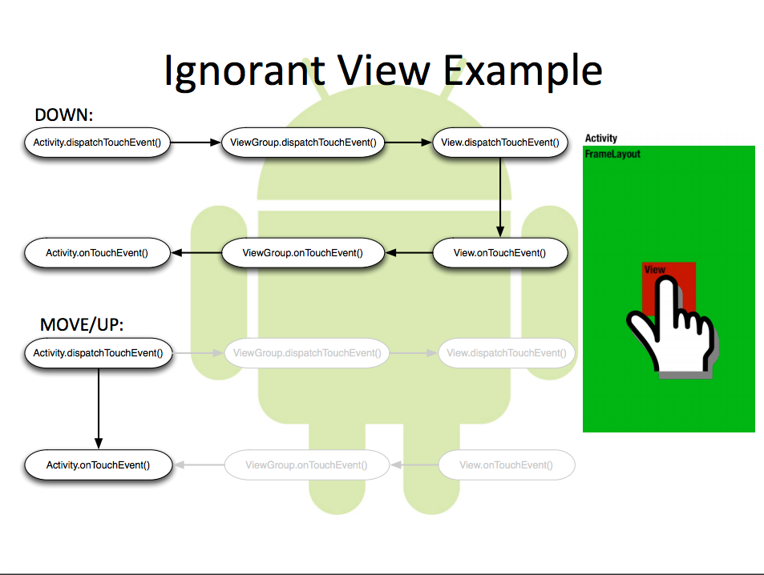
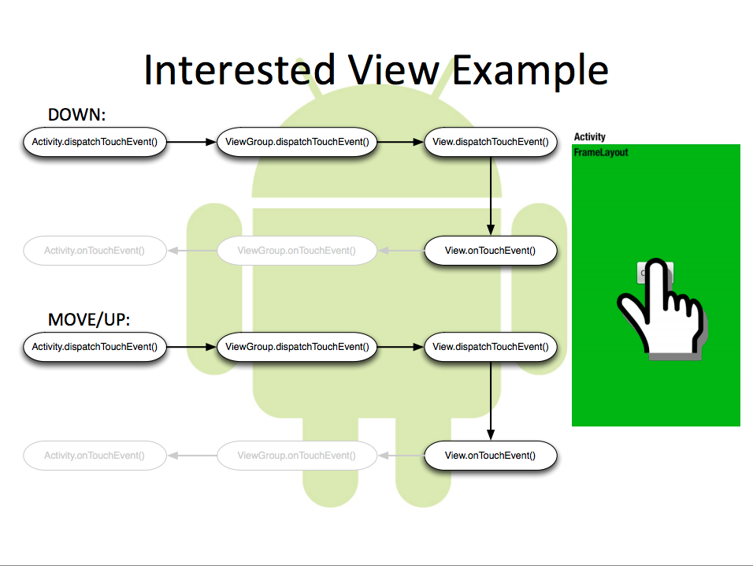
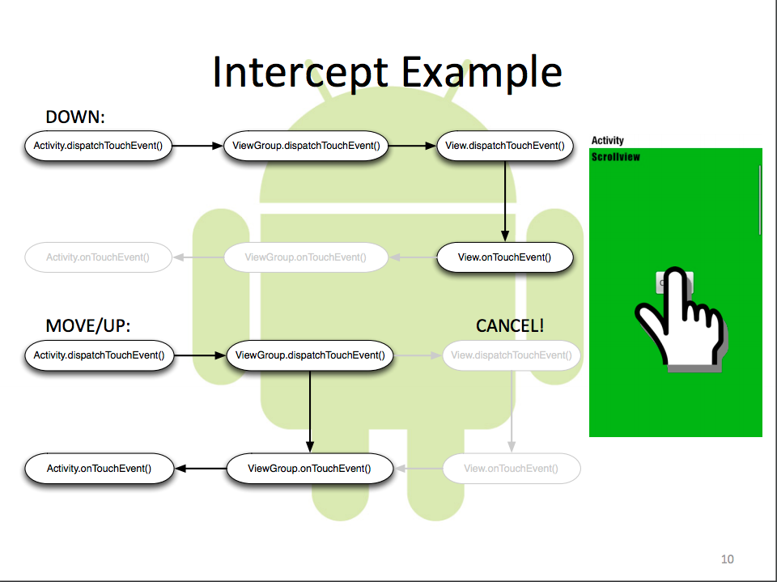

# 触摸事件

#### Android触摸事件的传递机制

每一个触摸事件全都包在 **MotionEvent** 里面

用户的触摸事件有下面几个行为：

- ACTION_DOWN
- ACTION_UP
- ACTION_MOVE
- ACTION_POINTER_DOWN
- ACTION_POINTER_UP
- ACTION_CANCEL

触摸事件包含的元数据：

- **Touch location**
- **Number of pointers (fingers)**
- **Event time**

一个触摸行为从 ACTION_DOWN 开始，以ACTION_UP结束；


Events从 Activity 开始，调用 dispatchTouchEvent()

Events 从 views的从顶向下传递

- Parents（ViewGroup）dispatch events to their children
- can intercept event at any time

Event 一直往下传播直到被消费掉（consumed）

- views 必须声明对ACTION_DOWN这个行为感兴趣
- 为了效率不会进一步传递了；

任何没有被消费掉的events 最后都会走到Activity的 onTouchEvent();

OnTouchListener 能拦截任何一个 View／ViewGroup的行为；

**Activity.dispatchTouchEvent()**

- 第一个被调用
- 把event传递到window的rootview
- onTouchEvent() :  如果没有view消费事件，会被调用，并且总是最后调用；

**View.dispatchTouchEvent()**

- 把event传递给listener（如果存在的话） ： View.OnTouchListener.onTouch();
- 如果没consumed，调用 ：View.onTouchEvent();

**ViewGroup.dispatchTouchEvent()**

- onInterceptTouchEvent() : 
  - 检查是不是要取代（supersede）子控件；
  - 传递ACTION_CANCEL 来激活子控件；
  - 一旦消费了所有后续event，返回true；
- 对于子View按照它们被添加的逆序
- 如果触摸事件是相关的 child.dispatchTouchEvent()
- 如果没有被之前的消费，向下传递
- 如果没有children处理event，可以调用listener：OnTouchListener.onTouch()
- 如果没有listener。onTouchEvent()
- 被拦截的events跳过 child步骤








#### 消费触摸事件（Custom Touch Handling）

**处理触摸事件：**

- override onTouchEvent()
- 提供一个 OnTouchListener()

**consuming event:**

- 如果对触摸事件感兴趣 在ACTION_DOWN里面返回 true；
- 如果在其他events里面返回true，将停止进一步处理；

**转发触摸事件（touch events）**

- 调用目标的dispatchTouchEvent()
- 避免直接调用目标的 onTouchEvent()

**盗取事件ViewGroup（Stealing touch events）**

- 子类重载（override）onInterceptTouchEvent()
- 当想取得触摸的控制权的时候，直接返回 true；
  - 所有后续行为都会直接调用你的 onTouchEvent()
  - 每一个onInterceptTouchEvent()都不会被调用
- 其余的目标单位都会收到消息ACTION_CANCEL

几个需要注意的点：

- 尽可能的调用super里面的函数：View.onTouchEvent() 做了好多状态管理，如果你每个都捕捉，很容易丢状态。
- ACTION_MOVE做溢出检查
- 记得处理ACTION_CANCEL：一些container包含了一些行为，比如 scrolling，会盗取事件，因此最好重设状态。CANCEL之后没有行为了
- 除非必须，否则不要劫持事件（intercept events）。

##### Batching

- 效率原因 ACTION_MOVE events可以在一个 MotionEvent中批量处理。


- 最后的event 通过 getX(), getY(), getEventTime()


- 中间的 getHistoricalX(), getHistoricalY(), getHistoricalEventTime() getHistoricalSize()


##### 系统触摸Handler

不要调用除非必须


### 触摸事件冲突

View 中包含的方法：

```java
public boolean dispatchTouchEvent(MotionEvent ev);
public boolean onTouchEvent(MotionEvent ev);
```

ViewGroup中包含以下三个方法：

```java
public boolean dispatchTouchEvent(MotionEvent ev);
public boolean onInterceptTouchEvent(MotionEvent ev);
public boolean onTouchEvent(MotionEvent ev);
```

Activity中包含的方法

```java
public boolean dispatchTouchEvent(MotionEvent ev);
public boolean onTouchEvent(MotionEvent ev);
```

事件传递的顺序是：Activity->Window->View，即事件总是先传递给Activity，然后在传递给Window，最后在传递给View，顶级View接收到事件后，就会按照事件分发机制去分发事件。

某个View一旦开始处理事件，如果它不消耗ACTION_DOWN事件，那么同一事件序列的其他事情都不会再交给它来处理，并且事件将重新交给它的父容器去处理（调用父容器的onTouchEvent方法）；如果它消耗ACTION_DOWN事件，但是不消耗其他类型事件，那么这个点击事件会消失，父容器的onTouchEvent方法不会被调用，当前view依然可以收到后续的事件，但是这些事件最后都会传递给Activity处理。


##### 关于滑动冲突

1. 同方向的滑动冲突：
   1. ScrollView 嵌套ListView，或者ScrollView嵌套自己；
2. 不同方向的滑动冲突：
   1. 比如ScrollView嵌套ViewPager，或者ViewPager嵌套ScrollView。（现在大部分应用，最外层都是ViewPager + Fragment的底部切换）


主要是拦截 onInterceptTouchEvent(MotionEvent e)

​	在MOVE中计算 当前位置和ACTION_DOWN之间的 x和y的距离，通过距离差判断是横向移动还是纵向移动。


当我们触摸屏幕上的某个控件时，底层的设备硬件传递给InputManager经过一定的处理后，传递给AmS，再经过AmS的处理后，传递到我们的Activity，接着传递Window，最后传递到顶级View；

```java
public boolean dispatchTouchEvent(MotionEvent ev)
用来分发事件，如果当前事件能传递到该View，该方法一定调用，View的onTouchEvent方法一定会调用，而该方法的返回值onTouchEvent影响。

public boolean onInterceptHoverEvent(MotionEvent ev);
用来拦截事件，如果返回为true，表示拦截，否则不拦截。

public boolean onTouchEvent(MotionEvent event);
处理当前事件的，如果返回true表示消耗该事件，否则无法再接受同一个序列的事件。

同一个序列的事件 DOWN--> MOVE(多个) --> UP
```

Android的事件分发流程：

Activity(Window) —> ViewGroup —>View