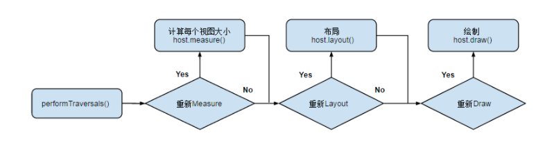
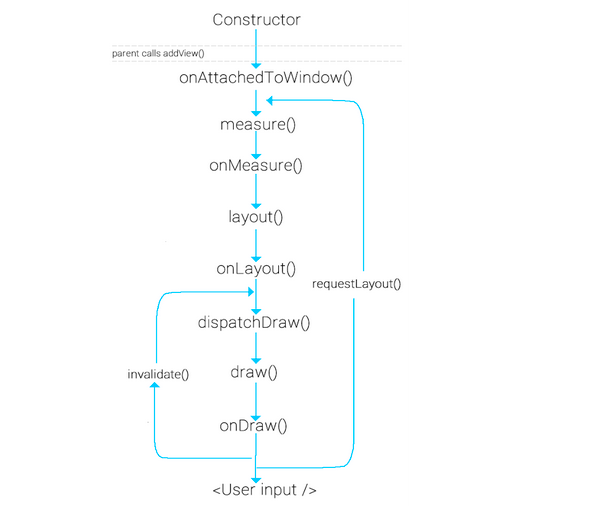
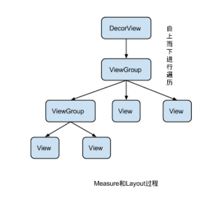
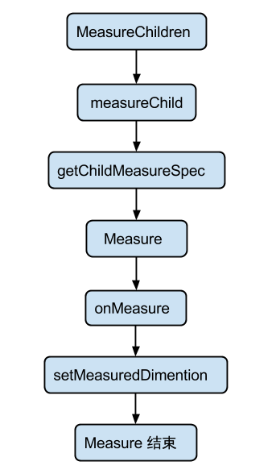
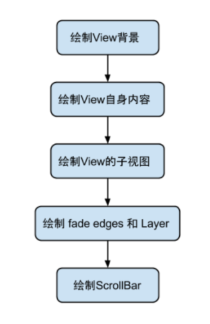

# View

#### View的绘制流程

绘制从根节点开始，对布局树进行measure 和 draw。

View的绘制流程在 ViewRoot 中的 performTraversals() 中展开。可以概括为：

- 是否需要重新计算视图大小（measure）
- 是否需要重新安置视图的位置(layout)
- 是否需要重新绘制(draw)

##### measure和layout

**Measure**

自上而下进行遍历，根据父视图对子视图的MeasureSpec以及ChildView自身的参数，通过 getChildMeasureSpec 函数获取childView的 MeasureSpec，回调ChildView.measure方法，最终调用setMeasuredDimension 得到ChildView的尺寸：mMeasuredWidth， mMeasuredHeight

**layout**

自上而下进行遍历，根据Measure过程得到的每个View的mMeasuredWidth mMeasuredHeight与计算得到的ChildLeft，ChildTop 进行布局 child.layout(left, top, left + width, top + height );

measure 过程会为一个 View 及所有子节点的 mMeasuredWidth 和 mMeasuredHeight 变量赋值，该值可以通过 `getMeasuredWidth()`和`getMeasuredHeight()`方法获得。而且这两个值必须在父视图约束范围之内，这样才可以保证所有的父视图都接收所有子视图的测量。如果子视图对于 Measure 得到的大小不满意的时候，父视图会介入并设置测量规则进行第二次 measure。比如，父视图可以先根据未给定的 dimension 去测量每一个子视图，如果最终子视图的未约束尺寸太大或者太小的时候，父视图就会使用一个确切的大小再次对子视图进行 

measure过程传递尺寸的两个类

- ViewGroup.LayoutParams (View自身的布局参数)
- MeasureSpecs类（父视图对子视图的测量要求）

**view.getLayoutParams()**方法获取一个视图的LayoutParams，获取的是它的**父视图的param**

**MeasureSpecs**

测量规格，包含测量要求和尺寸信息，有三种模式：

- UNSPECIFIED： 父视图不对子视图有任何约束，它可以达到所期望的任意尺寸。比如ListView，ScrollView，一般自定义View中用不到；
- EXACTLY：父视图为子视图指定一个确切的尺寸，而且无论子视图期望多大，它都必须在该指定大小的边界内，对应属性为match_parent或具体值。父控件可以通过MeasureSpec.getSize(measureSpec)直接取得子控件的尺寸；
- AT_MOST：父视图给子视图指定一个最大尺寸。子视图必须确保自己所有的子视图必须确保它自己所有子视图可以适应在该尺寸的范围内，对应的属性为wrap_content，这种模式下，父控件无法确定子View的尺寸，只能由子控件自己根据需求去计算自己的尺寸。

##### measure核心方法

- measure

- onMeasure ： measure回调

- setMeasuredDimension：在onMeasure中调用

  

  ##### layout的核心概念和方法

  子视图的位置都是相对于父视图而言的，View的onLayout方法为空实现，而ViewGroup的onLayout为abstract的。

  在layout的过程中，子视图会调用getMeasuredWidth() 和 getMeasuredHeight()方法获取得到measure过程得到的mMeasuredWidth和mMeasuredHeight，作为自己的width和height。然后调用每一个子视图的layout(l, t, r, b)函数，来确定每个子视图在父视图中的位置。

  layout —> setFrame

  ​

#####绘制流程的相关概念和核心方法

- View.draw(Canvas canvas)：所有视图最终都是调用View的draw方法进行绘制，在自定义视图中，也不是复写该方法，而是复写onDraw(Canvas)方法进行绘制，如果自定义视图要复写该方法，那么需要先调用Super.draw(canvas)进行系统绘制。
- View.onDraw(Canvas) ：默认是空实现，自定义绘制过程中需要复写方法，绘制自身的内容；
- dispatchDraw() 发起对子视图的绘制，不要管；

- drawChild(canvas, this, drawingTime)
- invalidate(): 请求重绘View树，即draw过程，假如视图发生大小没有变化就不会调用layout() 过程，并且只绘制那些调用了invalidate()方法的View。
- requestLayout()：当布局发生变化的时候，比如方向发生变化的时候，尺寸的变化，会调用该方法，在自定义视图中，如果某些情况下希望重新测量尺寸大小，应该手动去调用该方法，它会出发measure() 和 layout()过程，但不会重新draw。
