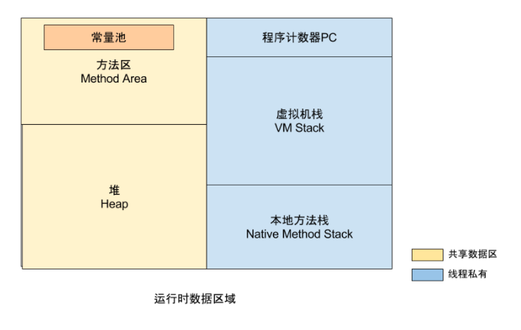
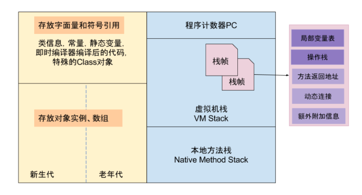

# JVM虚拟机

两大类

- 线程私有
  - 程序计数器：记录正在执行的虚拟机字节码的地址；
  - 虚拟机栈：方法执行的内存区，每个方法执行时会在虚拟机栈中创建栈帧；
  - 本地方法栈：虚拟机的Native方法执行的内存区；
- 共享数据
  - java堆：对象分配内存的区域；
  - 方法区：存放类信息，常量，静态变量，编译器编译后的代码等数据
    - 常量池：存放编译器生成的各种字面量和符号引用，是方法区的一部分

​	**java堆**

- 从内存回收角度分为：新生代和老年代，更快的回收内存；

- 从内存分配角度分为：Java堆可以划分出线程私有的分配缓冲区（Thread Local Allocation Buffer），更快的分配内存；

  java堆填充数据，保证分配8的倍数，即8字节对齐；